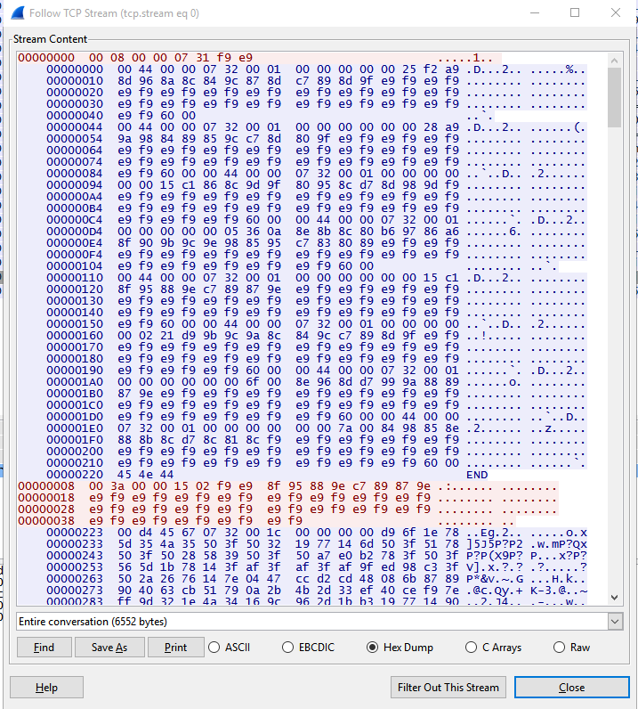
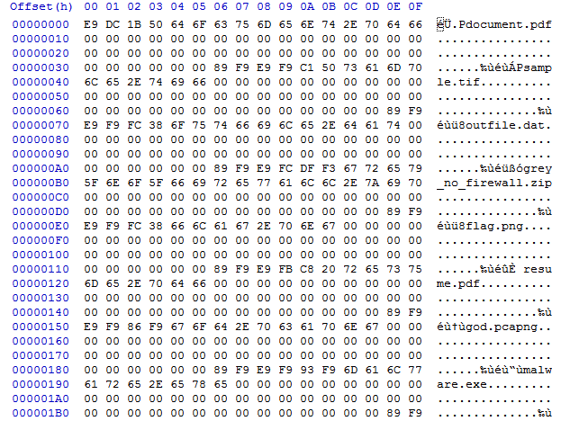
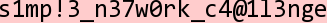

This is how we solved Forensics 150 :)

For this challenge, we were presented with a pcap file : [pcapin_73c7fb6024b5e6eec22f5a7dcf2f5d82.pcap](../uploads/csaw_quals_2015/pcapin_73c7fb6024b5e6eec22f5a7dcf2f5d82.pcap)

If you stare at the image below long enough, you will see a pattern oh how the transaction is taking place.



The first thing we did was to try and decode the first sequence of packets

This was sent

```
00000000  00 08 00 00 07 31 f9 e9                          .....1.. 
```

And this was recieved

```
    00000000  00 44 00 00 07 32 00 01  00 00 00 00 00 25 f2 a9 .D...2.. .....%..
    00000010  8d 96 8a 8c 84 9c 87 8d  c7 89 8d 9f e9 f9 e9 f9 ........ ........
    00000020  e9 f9 e9 f9 e9 f9 e9 f9  e9 f9 e9 f9 e9 f9 e9 f9 ........ ........
    00000030  e9 f9 e9 f9 e9 f9 e9 f9  e9 f9 e9 f9 e9 f9 e9 f9 ........ ........
    00000040  e9 f9 60 00                                      ..`.
    00000044  00 44 00 00 07 32 00 01  00 00 00 00 00 00 28 a9 .D...2.. ......(.
    00000054  9a 98 84 89 85 9c c7 8d  80 9f e9 f9 e9 f9 e9 f9 ........ ........
    00000064  e9 f9 e9 f9 e9 f9 e9 f9  e9 f9 e9 f9 e9 f9 e9 f9 ........ ........
    00000074  e9 f9 e9 f9 e9 f9 e9 f9  e9 f9 e9 f9 e9 f9 e9 f9 ........ ........
    00000084  e9 f9 60 00 00 44 00 00  07 32 00 01 00 00 00 00 ..`..D.. .2......
    00000094  00 00 15 c1 86 8c 9d 9f  80 95 8c d7 8d 98 9d f9 ........ ........
    000000A4  e9 f9 e9 f9 e9 f9 e9 f9  e9 f9 e9 f9 e9 f9 e9 f9 ........ ........
    000000B4  e9 f9 e9 f9 e9 f9 e9 f9  e9 f9 e9 f9 e9 f9 e9 f9 ........ ........
    000000C4  e9 f9 e9 f9 e9 f9 60 00  00 44 00 00 07 32 00 01 ......`. .D...2..
    000000D4  00 00 00 00 00 05 36 0a  8e 8b 8c 80 b6 97 86 a6 ......6. ........
    000000E4  8f 90 9b 9c 9e 98 85 95  c7 83 80 89 e9 f9 e9 f9 ........ ........
    000000F4  e9 f9 e9 f9 e9 f9 e9 f9  e9 f9 e9 f9 e9 f9 e9 f9 ........ ........
    00000104  e9 f9 e9 f9 e9 f9 e9 f9  e9 f9 60 00             ........ ..`.
    00000110  00 44 00 00 07 32 00 01  00 00 00 00 00 00 15 c1 .D...2.. ........
    00000120  8f 95 88 9e c7 89 87 9e  e9 f9 e9 f9 e9 f9 e9 f9 ........ ........
    00000130  e9 f9 e9 f9 e9 f9 e9 f9  e9 f9 e9 f9 e9 f9 e9 f9 ........ ........
    00000140  e9 f9 e9 f9 e9 f9 e9 f9  e9 f9 e9 f9 e9 f9 e9 f9 ........ ........
    00000150  e9 f9 60 00 00 44 00 00  07 32 00 01 00 00 00 00 ..`..D.. .2......
    00000160  00 02 21 d9 9b 9c 9a 8c  84 9c c7 89 8d 9f e9 f9 ..!..... ........
    00000170  e9 f9 e9 f9 e9 f9 e9 f9  e9 f9 e9 f9 e9 f9 e9 f9 ........ ........
    00000180  e9 f9 e9 f9 e9 f9 e9 f9  e9 f9 e9 f9 e9 f9 e9 f9 ........ ........
    00000190  e9 f9 e9 f9 e9 f9 60 00  00 44 00 00 07 32 00 01 ......`. .D...2..
    000001A0  00 00 00 00 00 00 6f 00  8e 96 8d d7 99 9a 88 89 ......o. ........
    000001B0  87 9e e9 f9 e9 f9 e9 f9  e9 f9 e9 f9 e9 f9 e9 f9 ........ ........
    000001C0  e9 f9 e9 f9 e9 f9 e9 f9  e9 f9 e9 f9 e9 f9 e9 f9 ........ ........
    000001D0  e9 f9 e9 f9 e9 f9 e9 f9  e9 f9 60 00 00 44 00 00 ........ ..`..D..
    000001E0  07 32 00 01 00 00 00 00  00 00 7a 00 84 98 85 8e .2...... ..z.....
    000001F0  88 8b 8c d7 8c 81 8c f9  e9 f9 e9 f9 e9 f9 e9 f9 ........ ........
    00000200  e9 f9 e9 f9 e9 f9 e9 f9  e9 f9 e9 f9 e9 f9 e9 f9 ........ ........
    00000210  e9 f9 e9 f9 e9 f9 e9 f9  e9 f9 e9 f9 e9 f9 60 00 ........ ......`.
    00000220  45 4e 44                                         END
```

By looking at the structure of the bytes, we initially came up with this structure for the data recieved.

```
    WORD wPacketLength
    WORD wUnknown1
    WORD wMarker1
    WORD wUnknown2
    DWORD dwUnknown3
    BYTE bPacketData[wPacketLength-12]
```

And using some guess work, we figured that the "key" was sent in the first set of data
Using the "key", we tried the most obvious, to xor the data with it



Using the same xor key, we decoded the second the 2nd send, it was requesting for flag.png

By now we had thought that we had this in the bag, use the same xor key and profit! :D
But when that didnt work, we took a valid png and tried to figure out the "new" xor key.
To decode the header, the key 0x50 0x3F was used, by now, we thought this is it, we win!.
But the organizers had a crueler fate planned for us and once again we were down a deeper rabbit hole.
After much mucking around it finally hit us, the packet header must contain some sort of key that is sent back with it to decode the data.
And after much experimentation we managed to solve this challnge.



SIMPLE MY ASS! :D

Our final script to deocde the png looks like below

```
import struct
import sys

def decode(input, key):
    key_pos = 0
    output = []
    for i in input:
        d = ord(i) ^ key[key_pos]
        output.append(chr(d))
        key_pos += 1
        if key_pos >= len(key):
            key_pos = 0
    return output

def decode_data(raw_file_in, raw_file_out):
    
    with open(raw_file_in, "rb") as f:
        data = f.read()

    with open(raw_file_out, "wb")as f:
        while len(data) > 3:
            key = [ 0xE9, 0xF9 ]
            if(ord(data[4]) != 0x07 and ord(data[5]) != 0x32):
                print hex(ord(data[4])), hex(ord(data[5]))
                print "Misalignment has occoured! :("
                sys.exit(-1)
            packet_size = int(struct.unpack(">H", data[0:2])[0])
            print "Packet Size : " + str(packet_size)
            print "Key Offset: " + hex(struct.unpack(">H", data[2:4])[0])
            print "key[0] = %.2x key[1] = %x " % (key[0], key[1])
            k1 = struct.unpack(">B", data[2:3])[0]
            k0 = struct.unpack(">B", data[3:4])[0]
            
            key[0] = (key[0] + k0) & 0xFF
            key[1] = ((key[1] + k1) & 0xFF) + 1
            print "key[0] = %.2x key[1] = %x k0= %.2x k1= %.2x" % (key[0], key[1], k0, k1)
            print "Unknown_2 : " + hex(struct.unpack(">H", data[4:6])[0])
            print "Unknown_3 : " + hex(struct.unpack(">H", data[6:8])[0])
            counter = struct.unpack(">H", data[8:10])[0]
            print "Unknown_4 : " + hex(struct.unpack(">H", data[10:12])[0])
            print "Counter : " + hex(counter)

            content = data[0x0C:packet_size]
            data = data[packet_size:]
            print "Balance of data = " + str(len(data))
            print ""

            sol = decode(content, key)
            f.write("".join(sol))

decode_data("recv_2.raw", "dump.png")
```

-KLKS