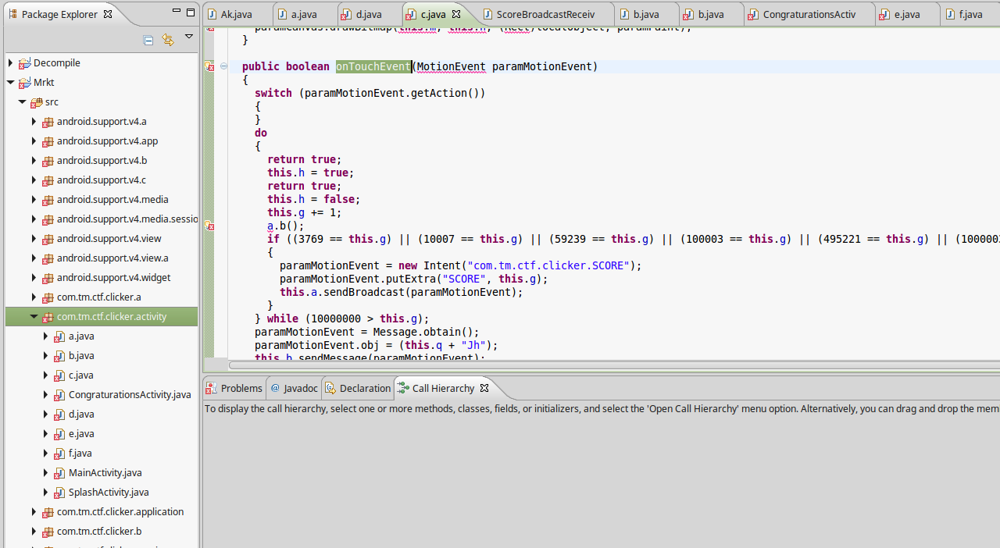
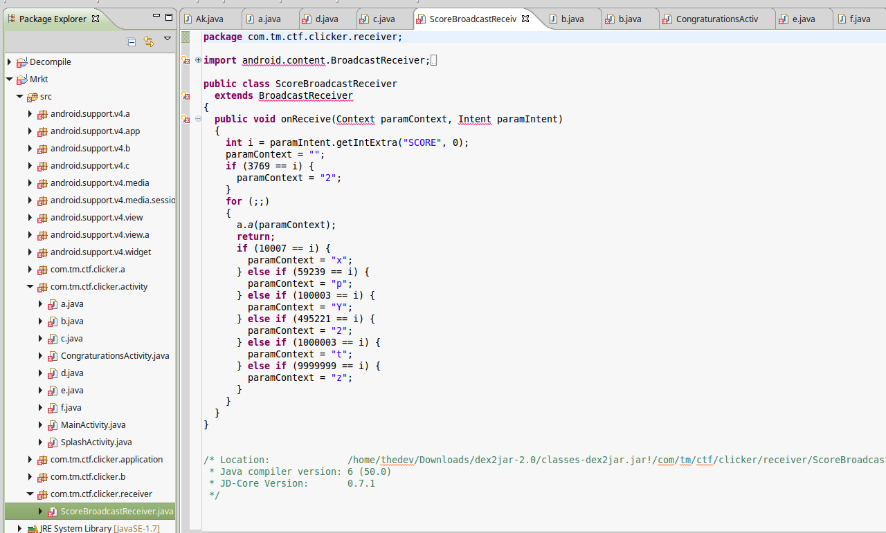
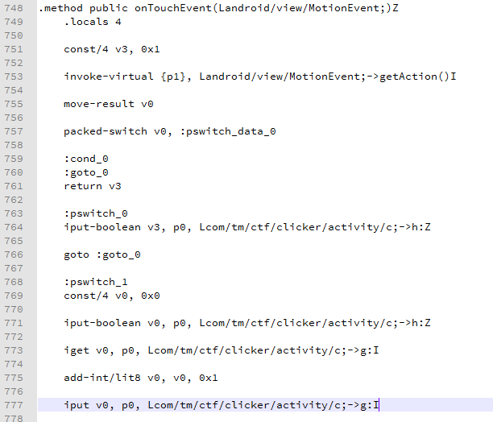

This is how I solved VirusClicker

For this challenge, first we decompile the android application to DEX code:
```
java -jar apktoo.jar d VirusClicker.apk
```

Now we have smali codes. We also decompile the code to native Java code, but we won't be able to recompile back from Java codes. At least in this case, I tried and it didn't work.
Simply I used dex2jar and I loaded the Java classes in JD-GUI, exported to Eclipse for better reading and refactoring.
While reading the code I noticed an interesting thing in **com.tm.ctf.clicker.activity.c**

This file does have **onTouchEvent** which is handler for our clicks over the button.


This function as you can see adds **1** to our click counter and calls **com.tm.ctf.clicker.SCORE** with current click count.


As you can see it uses shared preferences and if your click counts are equal to
**3769 OR 10007 OR 59239 OR 100003 OR 495221 OR 1000003 OR 9999999**

will write a char to DATA field in shared preferences, which you can also watch it in Android emulator. Just navigate to (/data/data/appfolder/shared_prefs)

So here I decided to patch related code in smali for Click counter.
This is original untouched smali code:


So I quickly wrote a code in a new Android project, I wrote this:

```java
public class MainActivity extends AppCompatActivity {
    private int g=0;
    @Override
    protected void onCreate(Bundle savedInstanceState) {
        super.onCreate(savedInstanceState);

        if (this.g == 1000003) this.g = 9999999;
        if (this.g == 495221) this.g = 1000003;
        if (this.g == 100003) this.g = 495221;
        if (this.g == 59239) this.g = 100003;
        if (this.g == 10007) this.g = 59239;
        if (this.g == 3769) this.g = 10007;
        if (this.g == 0) this.g = 3769;


        setContentView(R.layout.activity_main);
    }

```

So I compiled it to APK, then I used apktool to get smali code, I then replaced counter code which increases click count by 1 to increase it as we need. So after first click, counter will be 3769, then 10007, then 59239 and so on...

See:

```
# virtual methods
.method public onTouchEvent(Landroid/view/MotionEvent;)Z
    .locals 4

    const/4 v3, 0x1

    invoke-virtual {p1}, Landroid/view/MotionEvent;->getAction()I

    move-result v0

    packed-switch v0, :pswitch_data_0

    :cond_0
    :goto_0
    return v3

    :pswitch_0
    iput-boolean v3, p0, Lcom/tm/ctf/clicker/activity/c;->h:Z

    goto :goto_0

    :pswitch_1
    const/4 v0, 0x0

    iput-boolean v0, p0, Lcom/tm/ctf/clicker/activity/c;->h:Z

    iget v0, p0, Lcom/tm/ctf/clicker/activity/c;->g:I

#addition starts

	const v1, 0x98967f

	if-ne v0, v1, :cond_11

	const v0, 0x989680

	iput v0, p0, Lcom/tm/ctf/clicker/activity/c;->g:I
	:cond_11


	iget v0, p0, Lcom/tm/ctf/clicker/activity/c;->g:I

	const v1, 0xf4243

	if-ne v0, v1, :cond_12

	const v0, 0x98967f

	iput v0, p0, Lcom/tm/ctf/clicker/activity/c;->g:I

	:cond_12


	iget v0, p0, Lcom/tm/ctf/clicker/activity/c;->g:I

	const v1, 0x78E75

	if-ne v0, v1, :cond_13

	const v0, 0xF4243

	iput v0, p0, Lcom/tm/ctf/clicker/activity/c;->g:I

	:cond_13

	iget v0, p0, Lcom/tm/ctf/clicker/activity/c;->g:I

	const v1, 0x186A3

	if-ne v0, v1, :cond_14

	const v0, 0x78E75

	iput v0, p0, Lcom/tm/ctf/clicker/activity/c;->g:I

	:cond_14

	iget v0, p0, Lcom/tm/ctf/clicker/activity/c;->g:I

	const v1, 0xE767

	if-ne v0, v1, :cond_15

	const v0, 0x186A3

	iput v0, p0, Lcom/tm/ctf/clicker/activity/c;->g:I


	:cond_15

	iget v0, p0, Lcom/tm/ctf/clicker/activity/c;->g:I

	const v1, 0x2717

	if-ne v0, v1, :cond_16

	const v0, 0xE767

	iput v0, p0, Lcom/tm/ctf/clicker/activity/c;->g:I

	:cond_16

	iget v0, p0, Lcom/tm/ctf/clicker/activity/c;->g:I

	const v1, 0xEB9

	if-ne v0, v1, :cond_17

	const v0, 0x2717

	iput v0, p0, Lcom/tm/ctf/clicker/activity/c;->g:I

	:cond_17

	iget v0, p0, Lcom/tm/ctf/clicker/activity/c;->g:I

	const v1, 0

	if-ne v0, v1, :cond_18

	const v0, 0xEB9

	iput v0, p0, Lcom/tm/ctf/clicker/activity/c;->g:I


	:cond_18

#end addition

    invoke-static {}, Lcom/tm/ctf/clicker/a/a;->b()V

    const/16 v0, 0xeb9

...
...
...
...
```

Now I compiled it back using apktool, then used jarsigner to sign the new APK and loaded it in emulator.
I thought that's it and if I fix the clicker, all will be over. But for some reason, it just didn't work, maybe it was me. Anyway, clicker worked. Then it loaded Congragulations class/code and never showed flag.
So now I decided to analyze it in IDA.
When I read the code in Java decompiler, I noticed following code in **/src/com/tm/ctf/clicker/activity/b.java**:

```java
public b(Context paramContext, String paramString)
  {
    super(paramContext);
    this.b.addCallback(this);
    this.g = (paramString + "MT");
  }

  private void a(Canvas paramCanvas, Paint paramPaint)
  {
    int i = (int)paramPaint.measureText("Conguraturations!");
    paramCanvas.drawText("Conguraturations!", (this.c - i) / 2, this.d / 6 * 2, paramPaint);
    i = (int)paramPaint.measureText("The flag is ...");
    paramCanvas.drawText("The flag is ...", (this.c - i) / 2, this.d / 6 * 3, paramPaint);
    a();
    String str1 = com.tm.ctf.clicker.b.b.b(this.f.getBytes(), "click_machine").toString();
    String str2 = "TMCTF{" + this.f + "}";
    i = (int)paramPaint.measureText(str2);
    paramCanvas.drawText(str2, (this.c - i) / 2, this.d / 6 * 4, paramPaint);
    Log.i("VirusClicker", "length=" + str1.length());
  }

  public void a()
  {
    this.f = (this.g + "BN" + com.tm.ctf.clicker.a.a.e());
    this.f = com.tm.ctf.clicker.b.a.a(this.f);
  }

```

As you can see Flag consisted of some strings combined together, then base64 decoded in **com.tm.ctf.clicker.b.a.a(base64string)** which is being called in **void a()**

So string parts all should be placed in this.f which is a **String**

this.f = this.g which is **paramString** + 'MT
then **'BN'** appended to it, then output of **com.tm.ctf.clicker.a.a.e()**

So to dissect this:
**com.tm.ctf.clicker.a.a.e()** ==> String from DATA in shared_prefs
**paramString** is coming from ALL java codes, each one as loaded appends 1-2 chars to it, so we need dynamic analysis to find this one.

What I did is, I placed a breakpoint in Congragulations code in IDA, did the clicks and got 10M, then when it tried to show Congrats page which doesn't have flag, I opened **Locals** window in IDA and got the paramString. I got this: **Q29uZ3JhdHNf**

Then after 10M clicks, I read the shared_prefs (or I could've just combined the strings from Score code), it gave me: **Q2xpY2tzCg**

So adding the two string plus **BN** and **MT** in correct order, we get:
**Q29uZ3JhdHNfMTBNQ2xpY2tzCg==**

So we do:
```
root# echo Q29uZ3JhdHNfMTBNQ2xpY2tzCg== | base64 -d
Congrats_10MClicks
```
Then we add the TMCTF{} and final flag is:

**TMCTF{Congrats_10MClicks}**


-CodeAndSec
